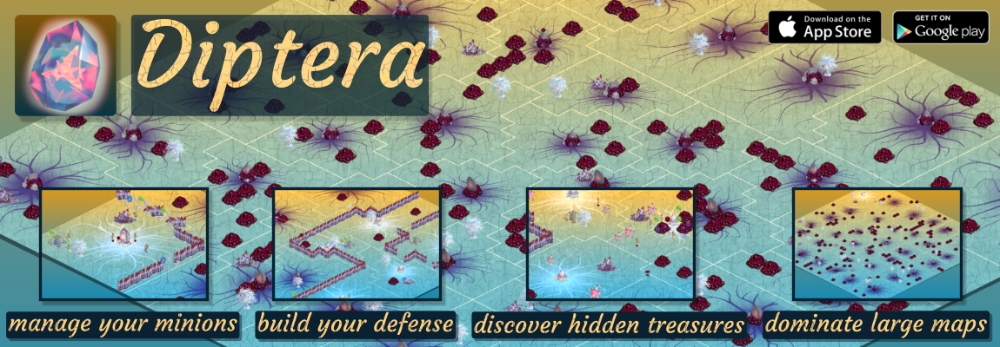
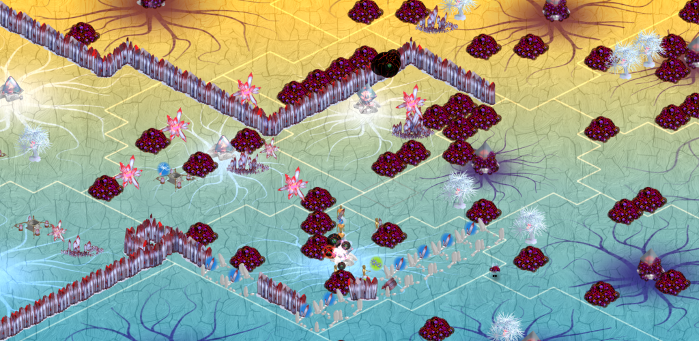

# Diptera 2D strategic game made in [Corona](https://coronalabs.com/product/) #

Diptera is a strategy-focused game with indirect minions control made in [Corona](https://coronalabs.com/product/).
It was released to [Android](https://play.google.com/store/apps/details?id=cz.plajt.diptera) 
and iOS (no longer on app store). 
 
##  Diptera features
   * genuine gameplay and graphics
   * graphics rendered by [Blender](https://www.blender.org/), resource files included
   * isometric grid map
   * [A* pathfinding](diptera_src/game/map/PathFinder.lua)  including [tie braking](http://theory.stanford.edu/~amitp/GameProgramming/Heuristics.html#breaking-ties)
   * micro management AI (minions are controlled indirectly)
   * computer opponent AI
   * in-game resource management
   * integration with [Flurry analytics](https://developer.yahoo.com/analytics/)
   * tutorial and world map
   * parametrized maps generator
   * debugging ui
   * i18n (English and Czech)
   * particle effects made with [Particle Designer(MAC only)](https://71squared.com/particledesigner)
 
This project contains most of the assets the oroginal game was released with.  

##  Gameplay
Nasty Diptera disease is spreading in a world full of sacred crystals. Thankfully there is a cure, it was just discovered.
But we need a leader. Help us to save our sacred world!
 
###  A bit more technical explanation of the game
Each level map is divided into areas controlled by one sacred crystal. The crystal is either infected or not. 
You as a player indirectly control minions by assigning them to different work categories. They cannot access
areas with infected crystals. Resources such as crystals, treasures and healing trees can be utilized
when accessible. Buildings or structures can be created by the minions with use of resources.
Ultimate goal of the game is to heal the main sacred crystal on the map. That usually requires strategic thinking,
wise resource management and good planning skills.

##  Getting Started

Most of the code is written in Lua using [Corona SDK](https://coronalabs.com/product/). I recommend to start with some 
[official tutorials](https://coronalabs.com/learn/) if not already familiar with Corona SDK.
[Corona's documentation](https://docs.coronalabs.com/)is easy to be found. The game was developed on 
Windows machine using Corona simulator, but the particle effects where created on MAC. 
Open [/diptera_src/main.lua](diptera_src/main.lua) in corona simulator to run the game on your machine.
 
I'm not a [Lua](https://www.lua.org/) master myself, this is first and so far the last project I made in Lua. 
Some degree of patience is required when working with source code. 

3D isometric graphics was done in [Blender](https://www.blender.org/). Rendering is automated by Python scripts.
2D graphics was made in [Xara](http://www.xara.com). All the blender models and textures are included in this project.

###  Documentation
Source code is not always documented. But many pieces of the code are. Usually the less straightforward parts
are documented.

There is a in-game event system with separated [documentation](diptera_src/docs/events.md).    

###  Prerequisites

* [Corona SDK](https://coronalabs.com/product/) with running simulator. 
* Basic [Lua](https://www.lua.org/) skills.
* [Blender](https://www.blender.org/) and [Python](https://www.python.org/) experience is helpful but not necessary.

##  Testing and debugging 
Some scripts has has testing and debugging features including hidden UI (FPS for exapmle) or additional logs. 
These features are mostly disabled by some boolean variable or by comments. Feel free to experiment. 

There are a lot of future improvement ideas in comments (sometimes in 
[Czech](https://en.wikipedia.org/wiki/Czech_language), sory about that).

##  Authors

First released version vas developed by [Vaclav Plajt](https://github.com/VaclavPlajt).

##  License

Fonts are licensed under [SIL OPEN FONT LICENSE Version 1.1 (OFL)](https://choosealicense.com/licenses/ofl-1.1/).
Rest of this project is licensed under
[Apache License Version 2.0](https://choosealicense.com/licenses/apache-2.0/).

Copyright 2017 Václav Plajt

Licensed under the Apache License, Version 2.0 (the "License");
you may not use this file except in compliance with the License.
You may obtain a copy of the License at

http://www.apache.org/licenses/LICENSE-2.0

Unless required by applicable law or agreed to in writing, software
distributed under the License is distributed on an "AS IS" BASIS,
WITHOUT WARRANTIES OR CONDITIONS OF ANY KIND, either express or implied.
See the License for the specific language governing permissions and
limitations under the License.

##  Acknowledgments

* [Amit Patel's Red Blob Games](https://www.redblobgames.com/) is excellent source of inspiration. 
* There a list of people who help with game testing of first released version.
 Their names where removed from open sourced project for privacy reasons.  

